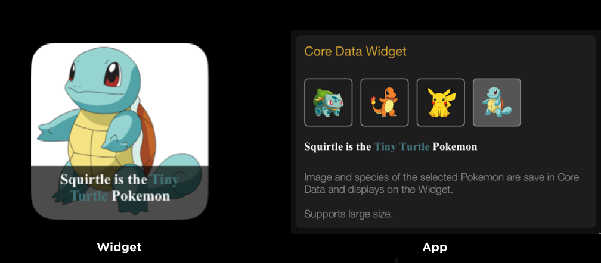
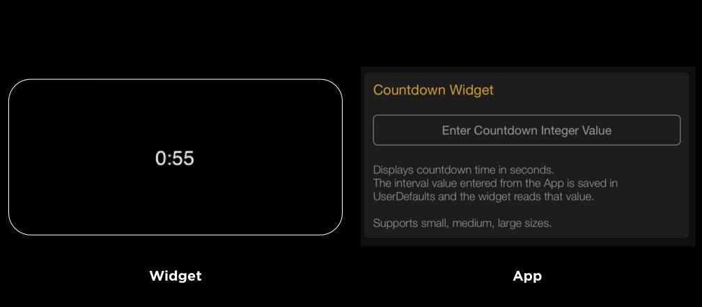
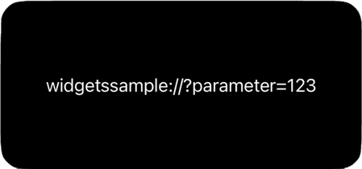
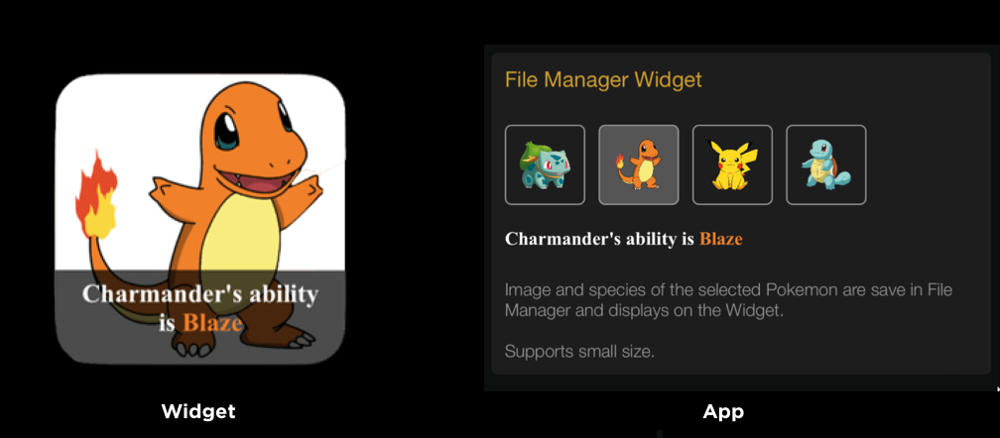
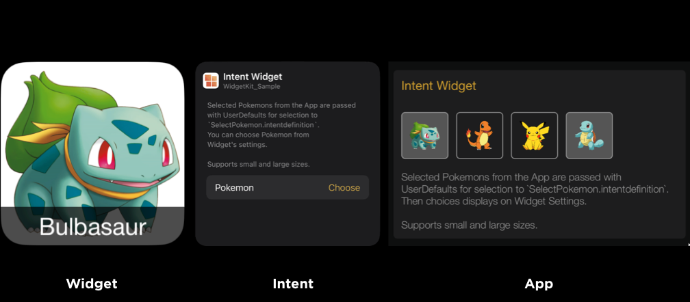
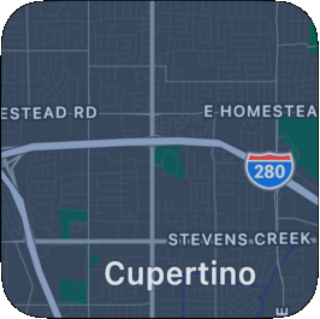
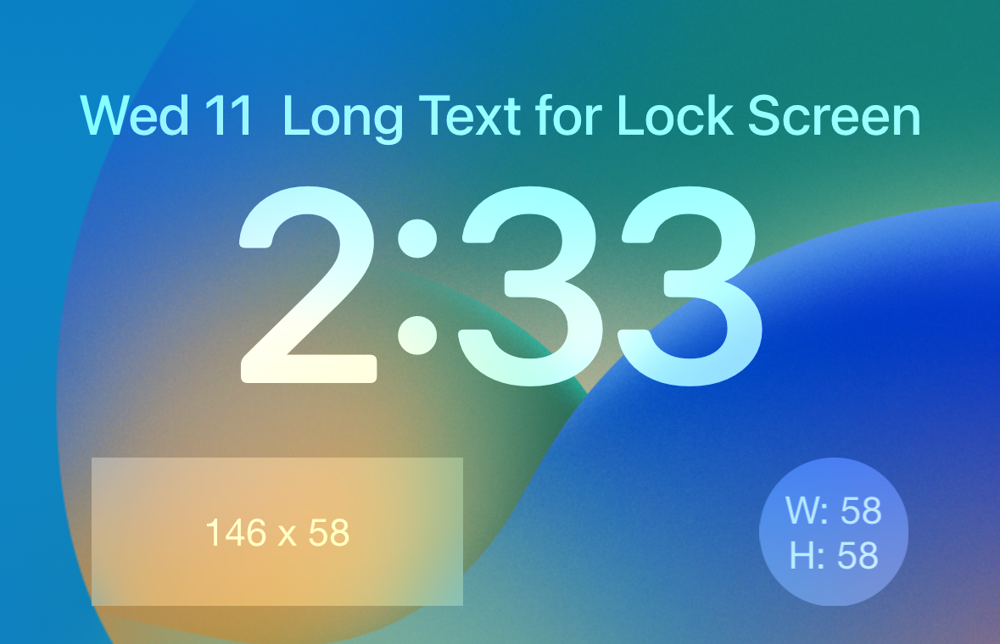
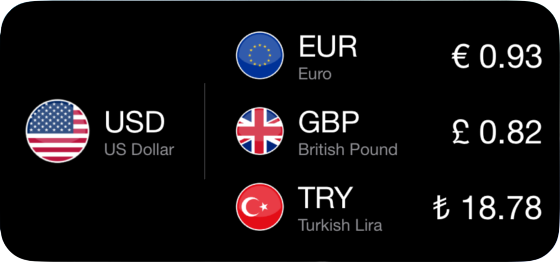
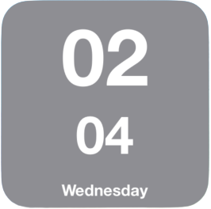
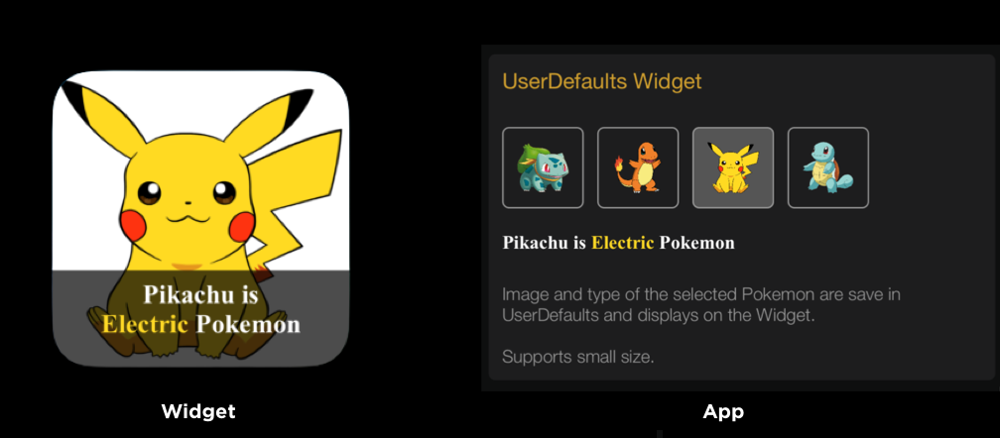

# readmesample
A sample project of different [WidgetKit](https://developer.apple.com/documentation/widgetkit) types.

## Installation
```sh
make install
make launch
```

## Types

| Name | |
| :--: | :---------- |
| AssetWidget |  |
| CoreDataWidget |  |
| CountdownWidget |  |
| DeepLinkWidget |  |
| FileManagerWidget |  |
| IntentWidget |  |
| LocationWidget |  |
| LockScreenWidget |  |
| NetworkWidget |  |
| TimerWidget |  |
| URLImageWidget |  |
| UserDefaultsWidget |  |